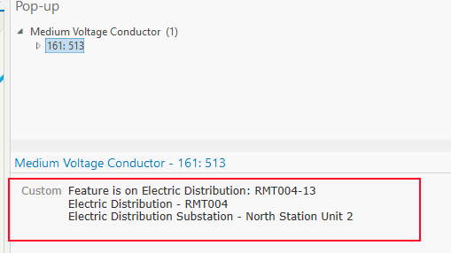

# Get the current and parent subnetworks in a pop-up

This example shows how to add a new attribute to quickly identify all parent subnetworks

## Use cases

For an electric network, the field and office staff need to know which networks are feeding a customer

## Workflow

Select a layer in ArcGIS Pro, Right click and select Configure Pop-up.  Add a new expression and copy and paste the expression found in the expression template below to the Arcade editor.  Adjust the layer id to match that of your device layer

## Expression Template

Create an expression to identify parent networks


```js
// This script will traverse the subnetwork table to find all neighboring and parent subnetworks

// ***************************************
// This section has the functions and variables that need to be adjusted based on your implementation

// The subnetwork table in a feature service is always layer id 500002 or named Subnetworks
// The subnetwork table in a FGDB UN is based on the DSID, it will be something like UN_5_Subnetwork
var subnetwork_fields = ['subnetworkname', 'globalid', 'featureglobalid', 'isdirty', 'tierrank', 'tiername'];
var subnetwork_table = FeatureSetByName($datastore, 'UN_5_Subnetworks', subnetwork_fields, false);

// The device class is the only class that can be controllers, use its map name or layer ID
// For services this is the name in the feature service or the layer ID
// In a FGDB, use the name of the feature class in the GDB
var device_table = FeatureSetByName($datastore, 'ElectricDevice', ['subnetworkname', 'globalid'], false);

// ************* End Section *****************


function get_parents(current_subnetwork) {
    // Filter the subnetwork table to get the controllers for the subnetwork the feature is on
    var results = Filter(subnetwork_table, 'subnetworkname = @current_subnetwork AND isdirty = 0');
    var global_ids = [];
    var i = 0;

    // Create a list of the controllers global IDs for the features subnetwork
    // NOTE: Count does not work on results
    for (var result in results) {
        global_ids[i++] = result.featureglobalid;
        controller_guid[Count(controller_guid)] = result.globalid;
        subnetwork_rows[Count(subnetwork_rows)] = result;
    }
    if (Count(global_ids) == 0) {
        return
    }
    // Filter the device class to get the subnetwork names from the controller feature
    var devices = Filter(device_table, "globalid IN @global_ids");
    var device_subnetworks = [];
    for (var device in devices) {
        // Store the device into a global variable
        controller_features[Count(controller_features)] = device;
        // If a controller has a parent network, the networks are concatenated with ::, continue if no parent
        if (Find('::', device.subnetworkname, 0) == -1) {
            continue
        }
        // Split on the subnetwork concatenation string
        var device_sub = Split(device.subnetworkname, '::');
        for (var j in device_sub) {
            // Only store the network if it is a parent, do not store the network that the controller is controlling
            if (device_sub[j] != current_subnetwork) {
                device_subnetworks[Count(device_subnetworks)] = device_sub[j];
            }
        }
    }
    // If not parent networks are found, exit function
    if (Count(device_subnetworks) == 0) {
        return;
    }
    // Get a unique set of subnetworks
    device_subnetworks = Distinct(device_subnetworks);
    // Loop through all parents, and store into global variable
    // using recursion, call get parents for each parent
    for (var parent_sub_idx in device_subnetworks) {
        get_parents(device_subnetworks[parent_sub_idx]);
    }
    return;
}

function create_result() {
    // If no controllers where found, ie, feature is not on a subnetwork, exit
    if (Count(controller_guid) == 0) {
        return "No Controllers Found";
    }
    // Dict of arrays with key as tier rank, each subnetwork controller row is store in here
    var results_dict = {};
    // Dict of strings with key as tier rank, each values is the subnetwork name
    var tier_names = {};
    // Array of the tier ranks as int
    var tier_ranks = [];
    // the current tier rank the feature resides on
    var feature_tier_rank;
    // Loop through the subnetwork rows found in get_parents
    for (var rowidx in subnetwork_rows) {
        // Store the row using the loop index
        var subnetwork_row = subnetwork_rows[rowidx];
        // Convert the tierrank to text as dict keys must be strings
        var tier_rank = Text(subnetwork_row.tierrank);
        // If the tier name as not been stored yet, store into list with tier_rank as key
        if (HasKey(tier_names, tier_rank) == False) {
            tier_names[tier_rank] = subnetwork_row.tiername;
        }
        // Store the current rank the feature resides on, do not store into result dict, as the current subnetwork is
        // displayed separately
        if (subnetwork_row.subnetworkname == $feature.subnetworkname) {
            feature_tier_rank = tier_rank;
            continue
        }
        // Store the tier rank, as a number, into array to arrange results
        tier_ranks[Count(tier_ranks)] = subnetwork_row.tierrank;
        // Init the dict with the tier rank as the key as an array
        if (HasKey(results_dict, tier_rank) == False) {
            results_dict[tier_rank] = [];
        }

        // Add to the array in the dict by tier rank the subnetwork name
        results_dict[tier_rank][Count(results_dict[tier_rank])] = subnetwork_row.subnetworkname
    }
    if (Count(tier_ranks) > 1) {
        // Get a unique list of tier ranks
        tier_ranks = Distinct(tier_ranks);
        // Sort the tier in descending order
        tier_ranks = Reverse(Sort(tier_ranks));
    }
    // Create the result value, first with tier the feature is on
    var result_string = "Feature is on " + tier_names[feature_tier_rank] + ": " + $feature.subnetworkname + " \n";
    // Loop through all the ranks, highest first
    for (var key_idx in tier_ranks) {
        // Get the key as text
        var tier_key = Text(tier_ranks[key_idx]);

        if (IsEmpty(results_dict[tier_key])) {
            // No other subnetworks are on the features tier
            continue
        }
        if (feature_tier_rank == tier_key) {
            // If you want to display the information about other subnetworks on the same tier as the feaures, change the
            // line below,
            result_string = result_string + tier_names[tier_key] + " - " + Concatenate(results_dict[tier_key], ', ') + " \n";
        } else {
            result_string = result_string + tier_names[tier_key] + " - " + Concatenate(results_dict[tier_key], ', ') + " \n";
        }
    }
    return result_string;
}

// Init Global Variables
var controller_guid = [];
var controller_features = [];
var subnetwork_rows = [];

if (IsEmpty(subnetwork_table) == true) {
    return "Subnetwork table not found"
}
if (IsEmpty(device_table) == true) {
    return "Device table not found"
}

// Call Get Parents to get parent Subnetworks
get_parents($feature.subnetworkname);
return create_result();

```


## Example output

[]
