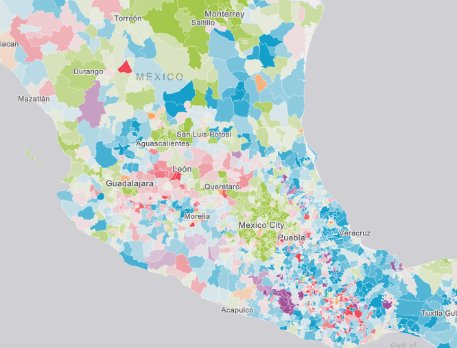

# Margin of Victory (Predominance Gap)

Returns the margin of victory (or gap) between the winning (or predominant) field and second highest 
value from a set of competing number fields as a percentage of the total of all 
competing fields. For example, if a layer contains three 
fields for vote totals (e.g. Republican, Democrat, Other), the % margin of victory
of the winner will be returned. This should be used in
conjunction with a predominance visualization.

Read the [Creating a predominance visualization with Arcade](https://blogs.esri.com/esri/arcgis/2017/05/23/creating-a-predominance-visualization-with-arcade/) blog post from
the ArcGIS blog for more information.

## Use cases

Calculating margin of victory is useful when you have several competing numeric fields, and you would like to 
indicate the gap between the winner and the next highest count among the fields. This is common in the visualization profile, 
but it may be used in the popup and labeling profiles as well. 

If creating a visualization in ArcGIS Online, this is particularly powerful when driving the opacity or size of features based on margin of victory.

## Workflow

Copy and paste the expression found in the expression template below to 
the Arcade editor in ArcGIS Online, the relevant location in ArcGIS Pro, or
the relevant location in a custom app.

To configure the script to your layer, you must construct an array of field values
referenced using the `$feature` global.

For example, in a layer representing U.S. counties containing voting data from the 2016 U.S. 
presidential election, you would replace this:

```js
var fields = [
  $feature.FIELD_NAME_1,
  $feature.FIELD_NAME_2
  // e.g. $feature.CATEGORY3_A + $feature.CATEGORY3_B,
  // $feature.CATEGORY4

  // ADD MORE FIELDS AS NECESSARY
];
```

With something like the following:

```js
var fields = [
  $feature.REPUBLICAN_VOTES,
  $feature.DEMOCRAT_VOTES,
  $feature.OTHER_VOTES
];
```

## Expression Template

```js
// The fields from which to calculate margin of victory.
// Each item in the array must reference a field global variable
// OR an arcade expression that returns a number
// Replace the field names in ALL CAPS with
// the competing fields in your layer

var fields = [
  $feature.FIELD_NAME_1,
  $feature.FIELD_NAME_2
  // e.g. $feature.CATEGORY3_A + $feature.CATEGORY3_B,
  // $feature.CATEGORY4

  // ADD MORE FIELDS AS NECESSARY
];

// Returns the gap, or margin of victory, between the 
// predominant field and the second highest value

var top2 = Top(Reverse(Sort(fields)), 2);
var winner = First(top2);
var secondPlace = top2[1];
var total = Sum(fields);
return Round(((winner - secondPlace) / total) * 100, 2);
```

## Example output

See [this webmap](https://jsapi.maps.arcgis.com/home/webmap/viewer.html?webmap=c453bcc6ab154f8ab7cf7acbeba2ce53) for examples of how to use this expression in ArcGIS Online.

[](https://jsapi.maps.arcgis.com/home/webmap/viewer.html?webmap=c453bcc6ab154f8ab7cf7acbeba2ce53)